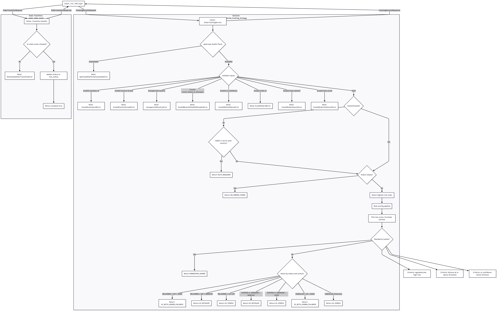

## Purpose Statement

### Business perspective
The customer-support feature decides how a customer should be assisted when they initiate an order-related action (for example: track an order, request a refund, cancel an order, or open a dispute).

Its goal is to provide fast, accurate assistance through automation when it is safe to do so, while protecting customers and the company by escalating to a human agent when identity requirements, regulatory constraints, fraud/dispute signals, low confidence, or repeated automation failures indicate higher risk.

The feature also ensures a consistent experience across channels (voice vs webchat), supports VIP service differentiation, and provides a safe fallback path when the system cannot confidently resolve the request.

### Tech perspective
This implementation exposes a clear public contract between a caller (UI/API layer) and a callee (decision engine) that transforms a request context and a customer action into a deterministic strategy outcome (for example: AI simple, AI detailed, mandatory human).

The callee validates inputs, selects the highest-risk order among multiple orders, and applies a rule-based decision table to choose the strategy. State changes are not triggered by explicit “events”; instead, state is handled implicitly across customer journeys, where a prior action can produce side-effects (e.g., open a dispute case, create a refund case) that are reflected in the context of subsequent requests.

The design includes well-named domain exceptions to represent validation failures and a dynamic upstream availability failure that is costly to reproduce in real environments.

## Business Requirements (Textual Rules)

### 4.1 Validation (Input Quality Rules)
- Customer ID must be non-blank, within configured length bounds, and contain only permitted characters.
- Country must be an uppercase ISO alpha-2 code; unsupported but correctly formatted countries are rejected distinctly.
- `recent_failed_ai_attempts` must be within configured range.
- `ai_confidence` must be a finite float within `[0.0, 1.0]`.
- Each order must have a valid `order_id`, `total_amount` within configured bounds, and `item_count` within configured bounds.
- Customer `action` must be one of the supported action types (e.g., track order, request refund, cancel order, open dispute).

### 4.2 Authentication Gate (Access Rule)
- If `authenticated` is false:
  - If `channel` is `VOICE` **OR** `country` is in `STRICT_AUTH_COUNTRIES` → return strategy `AUTH_REQUIRED`.
  - Otherwise processing continues (limited information scenario).

### 4.3 No Orders Rule
- If `orders` list is empty → return strategy `NO_ORDERS_FOUND`.

### 4.4 Highest-Risk Order Selection (Aggregation Rule)
- When multiple orders exist, the decision uses the "highest risk" order determined by:
  - High-value contributes `+2` (`total_amount >= HIGH_VALUE_THRESHOLD`)
  - Fraud flag contributes `+5`
  - Open dispute contributes `+3`
  - Highest score wins; ties keep the earliest order.

### 4.5 Mandatory Human Rule (Safety Rule)
- Return `MANDATORY_HUMAN` if any of the following is true:
  - (`country` in `REGULATED_COUNTRIES`) **AND** (order is high risk: high-value **OR** fraud **OR** dispute)
  - `recent_failed_ai_attempts >= THRESHOLD`
  - `ai_confidence < MIN_AI_CONFIDENCE`

### 4.6 Routing Rules (Decision Table Candidate)
- If selected order status is `DELIVERED`:
  - If VIP and `VOICE` → `AI_WITH_HUMAN_FALLBACK`
  - If VIP and `WEBCHAT` → `AI_DETAILED`
  - If not VIP → `AI_SIMPLE`
- If selected order status is `SHIPPED` or `UNKNOWN`:
  - `WEBCHAT` → `AI_DETAILED`
  - `VOICE` → `AI_SIMPLE`
- If selected order status is `CANCELLED`:
  - `US` + `VOICE` → `AI_WITH_HUMAN_FALLBACK`
  - else → `AI_SIMPLE`

### 4.7 Implicit State Progression (State-Transition Testing Candidate)
- The system does not expose explicit state-transition APIs.
- State progression is driven implicitly by the customer action and the current context:
  - Example: an “open dispute” action may create a dispute case, and subsequent requests reflect `open_dispute=True`.
  - Example: a “request refund” action may create a refund case, and subsequent requests may reflect refund-in-progress attributes (if present in the context model).
- State-transition testing is performed as sequences of customer actions where each step’s output/side-effects are reflected in the next step’s input context.

### 4.8 Dynamic Upstream Failure Rule (Hard-to-Reproduce)
- The callee may raise `UpstreamPlatformUnavailableError` due to transient external events
  (e.g., outage, maintenance, rate limiting). This is not a function of request inputs.

## 5) Test Design Opportunities (Mapping)
- **ECP/BVA:** validation variables + thresholds (attempts, confidence, amount, lengths, action)
- **Decision tables:** authentication + mandatory-human + routing rules (+ action-specific routing if added)
- **Pairwise:** channel × status × vip × country-class × authenticated × confidence-class × failures-class × action-class
- **Implicit state transitions:** sequences of (action + context) over time; verify outcomes across steps
- **Exception coverage:** each `Invalid*Error` + `UpstreamPlatformUnavailableError`

## 3) Input Variables (Test Design View)

### A) Core variables in `CustomerContext` (plus customer `action`)

| Variable | Type | Key partitions (ECP) | Key boundaries (BVA) |
|---|---|---|---|
| `customer_id` | string | valid vs blank vs invalid chars | min_len-1, min_len, max_len, max_len+1 |
| `country` | string | valid format & supported vs valid format & unsupported vs invalid format | len=1/2/3; lower/upper |
| `channel` | enum | VOICE vs WEBCHAT | n/a |
| `authenticated` | bool | true vs false | n/a |
| `is_vip` | bool | true vs false | n/a |
| `recent_failed_ai_attempts` | int | valid vs invalid; numeric vs non-numeric (if untyped input) | -1, 0, 1, threshold-1, threshold, threshold+1, max, max+1 |
| `ai_confidence` | float | in-range vs out-of-range vs NaN/inf | 0.49, 0.50, 0.51, 0, 1, -0.1, 1.1 |
| `action` | enum | TRACK_ORDER vs REQUEST_REFUND vs CANCEL_ORDER vs OPEN_DISPUTE (etc.) | n/a |
| `orders` | list | empty vs non-empty; multi-order tie vs unique highest | len=0, 1, 2+ |

### B) Per-order variables in `Order` (order summary used by decision engine)

| Variable | Type | Partitions | Boundaries |
|---|---|---|---|
| `order_id` | string | valid vs blank vs invalid chars | min-1/min/max/max+1 |
| `status` | enum | SHIPPED / DELIVERED / CANCELLED / UNKNOWN | n/a |
| `total_amount` | float | negative/zero/normal/huge/NaN/inf | threshold-ε, threshold, threshold+ε |
| `item_count` | int | negative/zero/normal/huge | -1, 0, 1, max, max+1 |
| `is_flagged_fraud_risk` | bool | true/false | n/a |
| `has_open_dispute` | bool | true/false | n/a |

### C) Implicit state progression variables (scenario-based)

> There is no explicit `OrderTransitionRequest`. State changes are exercised via sequences of requests where each step’s action and outcome (including side-effects) are reflected in the next step’s input context.

| Variable | Type | Partitions |
|---|---|---|
| `prior_action` | enum | TRACK_ORDER / REQUEST_REFUND / CANCEL_ORDER / OPEN_DISPUTE / ... |
| `current_order_status` | enum | SHIPPED / DELIVERED / CANCELLED / UNKNOWN |
| `derived_risk_flags` | booleans | fraud flag, open dispute, high-value derived from amount |
| `sequence_step` | integer | 1-step vs 2-step vs N-step journey |
| `next_context_update` | discrete change | dispute opened, refund initiated, failure count incremented, etc. |

# ============================
# Skeletal Public Interface
# ============================

from __future__ import annotations
from dataclasses import dataclass
from enum import Enum, auto
from typing import List, Optional, Dict, Any

# ============================================================
# Commons / Contract (Caller <-> Callee)
# ============================================================

# ---------
# Enums
# ---------

class Channel(Enum):
    VOICE = "VOICE"
    WEBCHAT = "WEBCHAT"

class OrderStatus(Enum):
    SHIPPED = "SHIPPED"
    DELIVERED = "DELIVERED"
    CANCELLED = "CANCELLED"
    UNKNOWN = "UNKNOWN"

class CustomerAction(Enum):
    """
    Customer-initiated intent; drives the decision and any implicit state progression.
    """
    TRACK_ORDER = "TRACK_ORDER"
    REQUEST_REFUND = "REQUEST_REFUND"
    CANCEL_ORDER = "CANCEL_ORDER"
    OPEN_DISPUTE = "OPEN_DISPUTE"

class Strategy(Enum):
    AI_SIMPLE = "AI_SIMPLE"
    AI_DETAILED = "AI_DETAILED"
    AI_WITH_HUMAN_FALLBACK = "AI_WITH_HUMAN_FALLBACK"
    MANDATORY_HUMAN = "MANDATORY_HUMAN"
    NO_ORDERS_FOUND = "NO_ORDERS_FOUND"
    AUTH_REQUIRED = "AUTH_REQUIRED"

class SideEffectType(Enum):
    """
    Optional: Represents implicit downstream effects that may occur as a result of handling an action.
    Not "explicit state transitions"; instead, intent signals to downstream systems.
    """
    CREATE_REFUND_CASE = "CREATE_REFUND_CASE"
    CREATE_DISPUTE_CASE = "CREATE_DISPUTE_CASE"
    ESCALATE_TO_AGENT_QUEUE = "ESCALATE_TO_AGENT_QUEUE"
    REQUIRE_AUTH_STEP_UP = "REQUIRE_AUTH_STEP_UP"

# ----------------------
# Request/Response DTOs
# ----------------------

@dataclass(frozen=True)
class OrderSummary:
    """
    Caller supplies order data OR references.
    For black-box tests, treat each field as an input variable.
    """
    order_id: str                      # string (length/charset partitions)
    status: OrderStatus                # discrete values
    total_amount: float                # float (threshold boundaries, NaN/inf)
    item_count: int                    # int (0/min/max/out-of-range)
    flagged_fraud_risk: bool           # boolean
    open_dispute: bool                 # boolean

@dataclass(frozen=True)
class TrackingDecisionRequest:
    """
    Primary request: decide response strategy for a customer action.
    State progression is handled implicitly via action + context.
    """
    action: CustomerAction             # discrete customer intent
    customer_id: str                   # string (blank, min/max length, invalid chars)
    country: str                       # "US","DE","FR",... (format vs supported vs unsupported)
    channel: Channel                   # VOICE vs WEBCHAT
    authenticated: bool                # boolean gate
    is_vip: bool                       # boolean (affects delivered handling)
    recent_failed_ai_attempts: int     # int (BVA around threshold, min/max)
    ai_confidence: float               # float 0..1 (boundary at 0.50, NaN/inf/out-of-range)
    orders: List[OrderSummary]         # list (empty vs non-empty; multi-order selection logic)

@dataclass(frozen=True)
class SideEffect:
    """
    Optional output describing an implied downstream action.
    Downstream system may apply it, and future requests reflect updated context variables.
    """
    effect_type: SideEffectType
    order_id: Optional[str] = None
    details: Dict[str, Any] = None

@dataclass(frozen=True)
class TrackingDecisionResponse:
    """
    Callee returns a strategy decision and optional implied downstream effects.
    """
    strategy: Strategy                 # final outcome
    selected_order_id: Optional[str]   # which order drove the decision (if any)
    reasons: List[str]                 # human-readable reasons (optional)
    side_effects: List[SideEffect]     # optional implied effects (for implicit progression)
    metadata: Dict[str, Any]           # future expansion (e.g., risk score, thresholds used)

# -------------------------
# Exceptions (Public Names)
# -------------------------

class OrderTrackingError(Exception):
    """Base error for all domain failures surfaced to callers."""

# Validation errors (input-controlled)
class InvalidCustomerIdError(OrderTrackingError): ...
class InvalidCountryFormatError(OrderTrackingError): ...
class UnsupportedCountryError(OrderTrackingError): ...
class InvalidRecentFailedAIAttemptsError(OrderTrackingError): ...
class InvalidAIConfidenceError(OrderTrackingError): ...
class InvalidOrderIdError(OrderTrackingError): ...
class InvalidOrderAmountError(OrderTrackingError): ...
class InvalidOrderItemCountError(OrderTrackingError): ...
class UnsupportedCustomerActionError(OrderTrackingError): ...

# Dynamic external error (not reliably controllable by input)
class UpstreamPlatformUnavailableError(OrderTrackingError): ...

# ============================================================
# Provider (Callee) public service interface
# ============================================================

class IOrderTrackingService:
    """
    Callee contract. Caller treats it as a black-box.
    State progression is implicit: action + context -> decision + optional implied effects.
    """

    def decide_strategy(self, request: TrackingDecisionRequest) -> TrackingDecisionResponse:
        """
        Decide the appropriate response strategy for a customer action.

        Raises:
            - Invalid*Error: validation failures
            - UnsupportedCustomerActionError: unsupported action
            - UpstreamPlatformUnavailableError: dynamic outage/rate-limit/maintenance
        """
        raise NotImplementedError

# ============================================================
# Consumer (Caller) public interface
# ============================================================

class CallerOutcome(Enum):
    """
    Caller-level outcomes; caller may map callee responses/exceptions to these.
    """
    AI_SIMPLE = auto()
    AI_DETAILED = auto()
    AI_WITH_HUMAN_FALLBACK = auto()
    MANDATORY_HUMAN = auto()
    NO_ORDERS_FOUND = auto()
    AUTH_REQUIRED = auto()

    BAD_REQUEST = auto()
    UPSTREAM_UNAVAILABLE = auto()
    INTERNAL_ERROR = auto()

@dataclass(frozen=True)
class CallerDecisionResult:
    outcome: CallerOutcome
    strategy: Optional[str] = None
    selected_order_id: Optional[str] = None
    reasons: List[str] = None
    side_effects: List[Dict[str, Any]] = None  # serialized SideEffect(s) for transport
    error_code: Optional[str] = None
    error_message: Optional[str] = None
    details: Dict[str, Any] = None

class IOrderTrackingCaller:
    """
    Caller contract: entrypoint used by UI/API layer.
    """

    def decide(self, request: TrackingDecisionRequest) -> CallerDecisionResult:
        """
        Wraps callee.decide_strategy.
        Converts exceptions into caller outcomes.
        """
        raise NotImplementedError

### Flowchart

