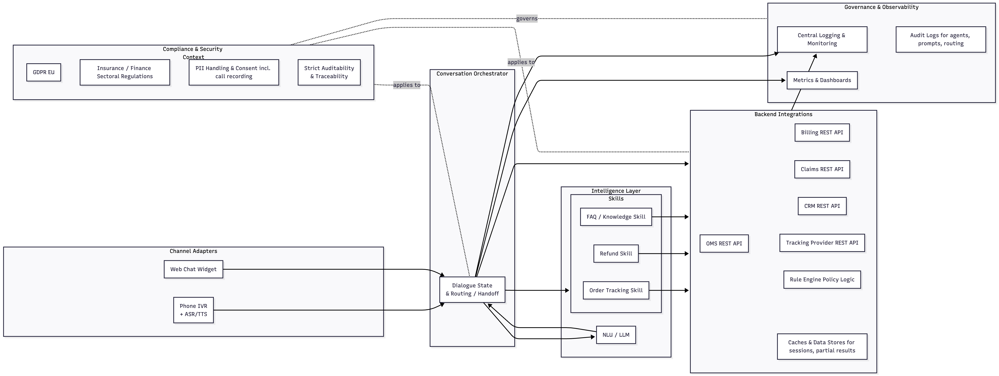

## Risk Analysis for a Multi-Channel AI Customer Service Agent

### Scenario

You are part of a cross-functional team (product, engineering, testing, compliance) at **ACME Insurance & Retail Group**. The company operates in:

- **Germany** and other **EU** countries  
- The **United States**

They use a a conversational AI platform to run customer service agents across:

- **Phone (voice)** via an IVR (Interactive Voice Response) + ASR (Automatic Speech Recognition) /TTS (Text to Speech)
- **Web chat** embedded in the customer portal and mobile web  

### In-Scope Use Cases

The current AI agent supports three primary flows:

1. **Order Tracking**
   - Customers ask: “Where is my package?”, “Has my policy card shipped?”, “What’s the status of my claim payout?”
   - The agent calls backend systems:
     - Order Management System (OMS)
     - Claims System
     - Shipment Tracking API (3rd party)

2. **Returns & Refunds**
   - Customers request returns for retail items or ask about premium refunds / overpayments.
   - Backend systems:
     - Payment Gateway
     - Billing System
     - Customer Relationship Management system (CRM) (for customer notes & flags, e.g., fraud risk)

3. **FAQs**
   - Coverage questions (insurance)
   - Opening hours, contact options, address changes
   - Policy-specific questions (deductibles, waiting periods, exclusions)
   - Sources:
     - Public Knowledge Base (KB)
     - Policy Rule Engine
     - Product Configurations per region

### 1.2 Architecture Sketch (Conceptual)

- **Channel Adapters**
  - IVR + ASR/TTS stack for phone
  - Web widget for chat

- **Conversation Orchestrator**
  - Manages dialogue state, routing, and handoff
  - Integrates with:
    - NLU / LLM
    - Skills (order tracking skill, refund skill, FAQ skill)

- **Backend Integrations**
  - REST APIs to OMS, Billing, Claims, CRM, Tracking Provider
  - Rule engine for policy logic
  - Caches & data stores (for sessions, partial results)

- **Governance & Observability**
  - Logging, monitoring, metrics dashboards
  - Audit logs for changes to agents, prompts, and routing tables

- **Compliance & Security Context**
  - GDPR applies in EU
  - Sectoral regulations for insurance/finance in all regions
  - PII handling, consent for call recording, strict auditability requirements

### Upcoming Change & Risk Trigger

The company is about to:

1. **Roll out a new version of the AI agent** with:
   - A more powerful LLM
   - New **auto-refund capability** for small overcharges (up to 100 EUR/USD) **without human approval**
   - Expanded support in **Spanish** for US customers

2. **Run a big campaign** driving customers to self-service (AI) instead of calling human agents.

Leadership wants a **structured risk analysis** before allowing the rollout into production across all regions and channels.

## 2. Your Task

You are a tester facilitating a **risk analysis workshop** with other testers and engineers for this AI agent. Design a **deep, structured risk analysis** for this rollout.

You do *not* need to fully “solve” everything during the exercise, but you must create a framework and partially fill it with concrete examples.

---

### Exercise Steps

#### Step 1 – Identify Critical Assets and Goals (15–20 minutes)

1. List **at least 5 critical assets** for this system, considering:
   - Customer data & PII
   - Money / refunds / payouts
   - Regulatory posture (compliance, auditability)
   - Brand trust & customer experience
   - System availability during peaks

2. For each asset, write:
   - **What is the value?**
   - **What does “harm” look like?** (e.g., financial loss, legal sanctions, customer churn)
   - **Relevant quality dimensions** (e.g., security, correctness, UX, fairness, performance)

_Expected output:_ Short bullet-point description per asset.

---

### Step 2 – Risk Brainstorm Using a Bug Taxonomy (35–45 minutes)

Using the patterns from the taxonomy (intent/entity issues, integration bugs, security/privacy, compliance, ML, observability, etc.), brainstorm risks specifically for **this scenario**.

1. **Pick 6–10 bug pattern families** that you think are most relevant to this rollout, for example:
   - Hallucinated / fabricated information  
   - Authorization & access control bugs  
   - Regulatory disclosure omissions  
   - PII exposure in responses/logs  
   - Training data coverage issues  
   - Rate limiting & scaling bugs  
   - Handoff & escalation failures  
   - Jurisdiction / regional rule bugs  
   - Etc.

2. For each chosen pattern family:
   - Describe **1–2 concrete risk scenarios** in this system, e.g.:
     - “Auto-refund flow issues a refund twice if the AI mistakenly replays the API call when the user says ‘I didn’t hear that’ on the phone.”
     - “Spanish FAQ answers systematically under-explain a regulatory exclusion, leading to misinformed consent in the US market.”
   - Explicitly map each risk to:
     - Affected **use case(s)** (order tracking, refunds, FAQs)
     - Affected **channel(s)** (voice, chat, both)
     - At least one **component likely responsible** (e.g., orchestration, integration layer, rule engine, prompt layer, NLU, ASR, TTS, web widget)

_Expected output:_ A list of concrete risk scenarios, each clearly tied to taxonomy patterns and components.

---

#### Risk Register with SDLC Mapping (45–60 minutes)

For **at least 6 of your risk scenarios** from Step 2, construct a **mini risk register**.

Create a table like this (expand rows as needed):

| Risk ID | Risk description | Taxonomy pattern(s) | Impact (H/M/L) | Likelihood (H/M/L) | Key asset at risk | SDLC stage where likely introduced | SDLC stage where most effectively detected | Main responsible components | Detection techniques (tests/monitoring) | Mitigations / controls |
|--------|-------------------|---------------------|----------------|--------------------|-------------------|-------------------------------------|--------------------------------------------|---------------------------|------------------------------------------|------------------------|

Populate at least the following for each selected risk:

- **Risk description**  
  - Clear, realistic, and scenario-specific.

- **Taxonomy pattern(s)**  
  - Reference the bug families (e.g., “Intent misclassification”, “Partial failure handling”, “Regulatory disclosure omissions”).

- **Impact & likelihood**
  - Use qualitative scale (H/M/L) and be prepared to justify.

- **Key asset at risk**
  - Link back to assets from Step 1.

- **SDLC stages**
  - Where it is most likely **introduced** (Req / Des / Imp / Int / Pre / Ops).
  - Where it is most efficient to **detect** it (and why).

- **Responsible components**
  - E.g., NLU/prompt layer, integration layer, rule engine, ASR/TTS, channel adapter, observability stack, CI/CD, etc.

- **Detection techniques**
  - At least 1–2 **test design techniques** or **monitoring strategies** from the taxonomy for each risk, e.g.:
    - Decision tables
    - End-to-end transaction tests
    - Red-teaming
    - Performance/load tests
    - Model evaluation on stratified datasets
    - Log-based anomaly detection, etc.

- **Mitigations / controls**
  - Preventive (design constraints, guardrail prompts, RBAC)
  - Detective (alerts, dashboards, audits)
  - Corrective (rollback strategy, manual review, kill-switch)

_Expected output:_ A filled risk register table with at least 6 meaningful entries.

---

#### Step 4 – Prioritize and Propose a Risk-Based Test Focus (25–30 minutes)

Using your risk register:

1. Choose the **top 3 risks** by combined severity (impact × likelihood).
2. For each:
   - Describe **what specific test activities** you would prioritize in the next sprint BEFORE go-live. Be explicit about:
     - Types of tests (functional, non-functional, security, compliance, ML evaluation, UX, etc.)
     - Techniques (from the taxonomy mapping)
     - Which **environment(s)** to run them in (sandbox, staging with mirrors of production data patterns, etc.)
     - Required **stakeholders** (e.g., legal/compliance, domain experts, call center reps, infra team).

3. Describe in 3–5 bullet points **how you would use production monitoring** (after go-live) to continuously manage these risks:
   - What metrics or signals would you set up?
   - What thresholds or alerts?
   - What kinds of periodic review (e.g., monthly conversation audits for mis-refunds, fairness checks, etc.)?

_Expected output:_ Short narrative for each top risk plus a concise post-go-live monitoring plan.

---

## 4. Deliverables

At the end of the exercise, participants should have:

1. **List of critical assets** and what “harm” looks like for each.
2. **Set of concrete risk scenarios** mapped to bug pattern families and system components.
3. A **risk register table** with at least 6 detailed risks, including:
   - SDLC mapping (where introduced vs. best detected)
   - Responsible components
   - Test/monitoring techniques
   - Mitigation strategies
4. A **prioritized risk-based test focus** for the upcoming rollout plus an outline of **post-go-live monitoring & review**.

---

## 5. Optional Extension (Homework)

As an extension:

- Take **one** risk scenario (e.g., “duplicate auto-refunds”) and design a **concrete test suite**:
  - Test cases (or charters) using the techniques they chose.
  - How they would automate and integrate them into CI/CD.
  - How failures in those tests would block or gate the release.

This deepens the connection between risk analysis and practical testing strategy.
