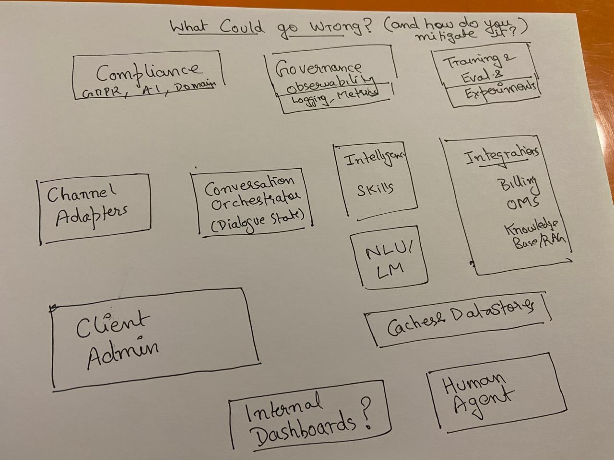

## “What Could Go Wrong?” (and how do we catch it?)

### Goal

- Understand dependencies between chatbot components
- Think in terms of risks, impact/likelihood, and propagation
- Map risks to testing techniques and other mitigations

### Sample Component Names in an AI chatbot implementation

The above image has some possible components listed:

- Channel Adapters (web, mobile, WhatsApp, etc.)
- Conversation Orchestrator
- Intelligence / Skill Layer
- NLU
- Caches / Data Stores
- Internal Dashboards
- Client Admin Dashboard
- Compliance
- Governance
- Training & Evaluation

### Exercise

1. Each participant:
- Picks one primary component. It could be representative of what they are working on currently or what is thematically the closest.
- Makes a list of components from the list with it shares first degree if input/output relationship (upstream as well as downstream)
2. Now for the related components, groups are formed. Otherwise, we adjust till we have groups of 2-3 people in each team.
3. Participants then go on with the following steps (in both directions):
3.1 Create the risk profile of their own component based on what they think is the criticality of their component in the overall architecture in terms of the following quality dimensions (they can add more dimensions as they find fit.):
- Functionality (Its role in the overall functionality of the chatbot.)
- Performance
- Security
- UX
- Globalization
- Compliance with Law & Standards
- Technical Dimensions: Extensibility etc. which are critical for future business
3.2 For each type of quality dimension, write one example of a risk e.g. "NLU misclassifies intents for rare queries"
3.3 They assess the risks from the input components which are relevant for them.
3.4 They assess the risks which their component can cause for the immediate components that they send output to.
3.5 Map these risks to methods of mitigation:
- Preventive (design, process, governance)
- Detective (tests (levels & types), monitoring, alerts)
- Corrective (fixes, regression/confirmation testing, rollbacks, etc.)
4. They present, based on the time available, what they found interesting in the output.

### A short example of a risk

#### Risk

NLU misclassifies user intent for high-stakes queries (Impact 5, Likelihood 3)

#### Risk-Type
- Self-created: Improper/Incomplete prompt, Missing Examples etc.
- Inputs: Training & Evaluation (bad data), Governance (weak guardrails), Data Stores (wrong context)
- Outputs: Conversation Orchestrator, Compliance

#### Testing ideas
- NLU test set with critical scenarios
- Adversarial testing

#### Testing Techniques
- ECP/BVA
- Decision Tables
- Exploratory Testing, Metamorphic Testing

#### Testing Levels
- Component Testing
- Acceptance Testing

#### Other mitigations
- Regression tests to look for side-effects of other changes on intent classification
- Online evaluation with canary deployment
- Clearly labeled high-risk intents
- Human-in-the-loop for specific flows
- Monitoring misclassification rates

