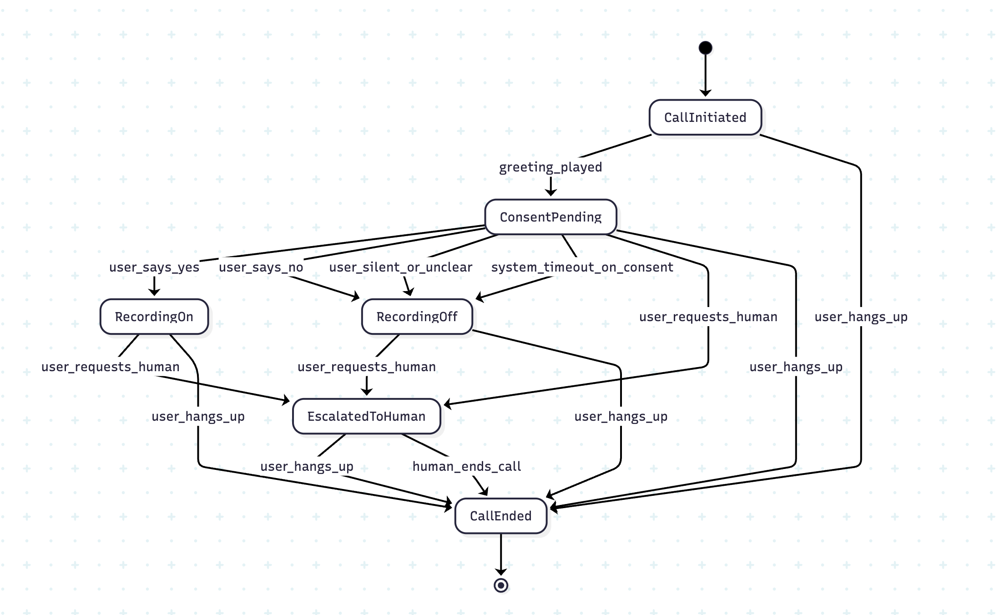
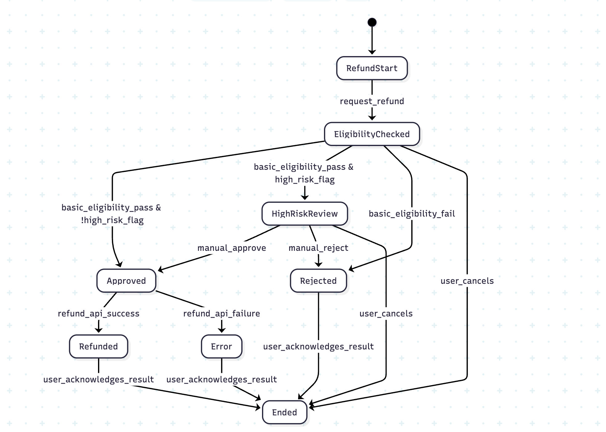

## State Transition Testing

For the following exercises:

1. Identify the states & transition.
2. Determine the minimum number of test cases which are needed for All States, All Valid Transitions and All Transitions Coverage

### Exercise 1 – Voice Consent & Call Recording

#### Scenario

In a regulated market, every voice call must either:
- Have explicit consent to be recorded, or
- Continue without recording if consent is unclear / denied.

You want to model the consent + recording states.

##### States
- `CallInitiated` – Call connected, greeting about to play
- `ConsentPending` – Asking user for recording consent
- `RecordingOn` – Consent given, call being recorded
- `RecordingOff` – No consent; call continues, but no recording
- `EscalatedToHuman` – Transferred to a human agent
- `CallEnded` – Call has ended

##### Transitions

- `greeting_played`
- `user_says_yes`
- `user_says_no`
- `user_silent_or_unclear`
- `system_timeout_on_consent`
- `user_requests_human`
- `user_hangs_up`
- `human_ends_call`

### Exercise 2 – Refund with Risk Review

#### Scenario

Refunds must:
- Be eligible
- For high-risk cases, go to manual review
- Either be approved and executed, or rejected

##### States

- RefundStart – User started refund request
- EligibilityChecked – Basic checks done
- HighRiskReview – Manual review required
- Approved – Approved for execution
- Rejected – Rejected
- Refunded – Payment executed
- Error – Technical failure during execution
- Ended – Conversation end

##### Transitions

- `request_refund`
- `basic_eligibility_pass`
- `basic_eligibility_fail`
- `high_risk_flag`
- `manual_approve`
- `manual_reject`
- `refund_api_success`
- `refund_api_failure`
- `user_acknowledges_result`
- `user_cancels`

