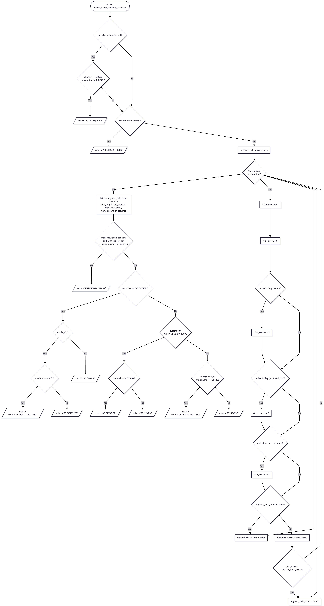

## White-box Testing

The goal of this exercise is to explore the following types of code coverage given a single Python function:

1. Statement coverage  
2. Branch (decision) coverage  
3. MC/DC  
4. Loop coverage 
5. Path coverage   

---

## The Code Under Test

Context:  
This function decides **how an AI agent should handle an order-tracking call** in a regulated environment (insurance/finance, multi-region). It returns a `strategy` label that later drives orchestration (AI-only, AI+human, mandatory human, etc.).

```python
from enum import Enum, auto
from dataclasses import dataclass
from typing import List, Optional


class Channel(Enum):
    VOICE = auto()
    WEBCHAT = auto()


@dataclass
class Order:
    order_id: str
    is_high_value: bool
    is_flagged_fraud_risk: bool
    has_open_dispute: bool
    status: str  # "SHIPPED", "DELIVERED", "CANCELLED", "UNKNOWN"


@dataclass
class CustomerContext:
    customer_id: str
    country: str  # "DE", "US", "FR", ...
    is_vip: bool
    authenticated: bool
    channel: Channel
    orders: List[Order]
    recent_failed_ai_attempts: int  # how many failed AI conversations in last 24h


def decide_order_tracking_strategy(ctx: CustomerContext) -> str:
    """
    Returns one of:
    - "AI_SIMPLE"
    - "AI_DETAILED"
    - "AI_WITH_HUMAN_FALLBACK"
    - "MANDATORY_HUMAN"
    - "NO_ORDERS_FOUND"
    - "AUTH_REQUIRED"
    """

    # 1. Authentication gate
    if not ctx.authenticated:
        # Voice requires stricter auth for order data than webchat in this example
        if ctx.channel == Channel.VOICE or ctx.country in ("US", "DE"):
            return "AUTH_REQUIRED"

    # 2. No orders
    if not ctx.orders:
        return "NO_ORDERS_FOUND"

    # 3. Compute highest-risk order (loop)
    highest_risk_order: Optional[Order] = None
    for order in ctx.orders:
        # simple risk score
        risk_score = 0
        if order.is_high_value:
            risk_score += 2
        if order.is_flagged_fraud_risk:
            risk_score += 5
        if order.has_open_dispute:
            risk_score += 3

        if highest_risk_order is None:
            highest_risk_order = order
        else:
            # choose the order with the highest "riskiness"
            current_best_score = (
                (2 if highest_risk_order.is_high_value else 0)
                + (5 if highest_risk_order.is_flagged_fraud_risk else 0)
                + (3 if highest_risk_order.has_open_dispute else 0)
            )
            if risk_score > current_best_score:
                highest_risk_order = order

    # At this point, highest_risk_order is not None because we checked orders above
    o = highest_risk_order

    # 4. High-risk scenarios → mandatory human
    # Compound condition we will use for MC/DC
    high_regulated_country = ctx.country in ("DE", "FR")
    high_risk_order = (o.is_high_value or o.is_flagged_fraud_risk or o.has_open_dispute)
    many_recent_ai_failures = ctx.recent_failed_ai_attempts >= 2

    if (high_regulated_country and high_risk_order) or many_recent_ai_failures:
        return "MANDATORY_HUMAN"

    # 5. Detailed vs simple AI, plus human fallback
    # Status + VIP + channel logic
    if o.status == "DELIVERED":
        if ctx.is_vip:
            # VIPs get more detailed answer, plus human fallback on voice
            if ctx.channel == Channel.VOICE:
                return "AI_WITH_HUMAN_FALLBACK"
            else:
                return "AI_DETAILED"
        else:
            return "AI_SIMPLE"

    elif o.status in ("SHIPPED", "UNKNOWN"):
        # In-flight shipment → more detailed handling on webchat
        if ctx.channel == Channel.WEBCHAT:
            return "AI_DETAILED"
        else:
            return "AI_SIMPLE"

    else:  # CANCELLED or any other status
        # For cancelled orders in US on voice, we want a human fallback
        if ctx.country == "US" and ctx.channel == Channel.VOICE:
            return "AI_WITH_HUMAN_FALLBACK"
        return "AI_SIMPLE"
```

## The Exercise

---

### Part 1 – Identify Decisions and Conditions (for Branch & MC/DC)

1. List all decision points (every `if`, `elif`, `else`, and important loop decision) in `decide_order_tracking_strategy`.

2. For each decision, write down:
   - The **decision expression** (e.g., `if not ctx.authenticated:`).
   - Whether it is:
     - A **simple decision** (single boolean expression with no logical `and`/`or`), or
     - A **compound decision** (contains multiple boolean conditions combined with `and`/`or`).

3. For the compound decision that controls `MANDATORY_HUMAN`:

   ```python
   if (high_regulated_country and high_risk_order) or many_recent_ai_failures:
   ```

    Break it down into atomic conditions:

    - A = high_regulated_country
    - B = high_risk_order
    - C = many_recent_ai_failures

    This will be your focus for MC/DC in Part 3.

### Part 2 – Design Tests for Statement & Branch Coverage

#### Statement coverage

1. Design a minimal set of test cases that ensures every executable statement in the function is executed at least once.

2. Give each test an ID (e.g., T1, T2, …).

3. For each test, specify:

    - country, authenticated, channel, orders list (contents), is_vip, recent_failed_ai_attempts, and expected return value.

4. Show for each test which new parts of the code it covers (e.g., “covers the NO_ORDERS_FOUND branch”, “covers the US/VOICE cancelled logic”, etc.).

#### Branch (decision) coverage

1. Extend or refine your test set so that every decision’s true and false outcomes are exercised at least once.

2. For each decision identified in Part 1, map which tests cause it to evaluate to True and which cause it to evaluate to False.

3. If a decision is part of a loop (e.g., for order in ctx.orders: implicitly has a loop “continue?” condition), explain how your tests ensure:

    - The loop body executes at least once, and
    - The loop termination condition is exercised.

### Part 3 – MC/DC on the MANDATORY_HUMAN Gate

Recall the decision:
  ```python
  if (A and B) or C:
    return "MANDATORY_HUMAN"
  ```

with
- A = high_regulated_country
- B = high_risk_order
- C = many_recent_ai_failures

Task:

1. Design a minimal MC/DC test set for this decision.

2. For each test, show (A, B, C) and the outcome of the decision.

3. Demonstrate that each atomic condition can independently influence the outcome while the other conditions are held constant (this is the MC/DC criterion).

4. For each MC/DC test, construct a full CustomerContext that makes the condition values and outcome actually happen in the real code (not just the abstract A/B/C table). That means:
    - Choosing country values to control A.
    - Crafting orders (with is_high_value, is_flagged_fraud_risk, has_open_dispute) to control B.
    - Setting recent_failed_ai_attempts to control C.

### Part 4 – Loop Coverage on the Risk Calculation

For the for order in ctx.orders: loop, design test sets that satisfy loop coverage criteria:

You should have tests where:

1. 0 iterations: The loop body is never executed (hint: which input leads to that?).

2. 1 iteration: Exactly one order is processed.

3. 2 or more iterations: Multiple orders are processed, and the `if risk_score > current_best_score:` branch is:

    - Taken at least once.
    - Not taken at least once.

For each of these, specify:

- The list of Order objects and their flags.
- Which statements and branches inside the loop are covered.


### Part 5 – Path Coverage (with Realistic Constraints)

1. Enumerate logical paths (at a high level) from function entry to return, ignoring the internal for loop permutations for now.

For example, one path might be:
AUTH_REQUIRED path → if not authenticated true and nested if → return "AUTH_REQUIRED".

Another path:
Authenticated → Orders present → Non-mandatory human gate false → DELIVERED + VIP + VOICE → AI_WITH_HUMAN_FALLBACK.

2. Focus on distinct outcome paths (different return labels) and key structural variants:

- AUTH_REQUIRED
- NO_ORDERS_FOUND
- MANDATORY_HUMAN
- AI_SIMPLE
- AI_DETAILED
- AI_WITH_HUMAN_FALLBACK

Task:

1. Design test cases so that each distinct return value is reached at least once.

2. Then, refine that set to try approaching path coverage for:

    - DELIVERED block – VIP vs non-VIP, VOICE vs WEBCHAT.
    - SHIPPED/UNKNOWN block – VOICE vs WEBCHAT.
    - else block – CANCELLED/other statuses, US/VOICE vs others.

Reflect:

1. Explain why achieving full path coverage (including all permutations of loop iterations and risk score comparisons) is not feasible in practice for this function as it scales with the number of orders and combinations.

2. Argue how branch coverage + MC/DC + loop coverage gives a good practical approximation for thorough white-box testing here.


### Control Flow Graph for Reference


